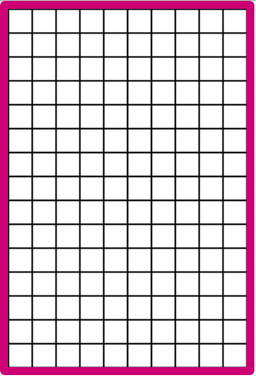

# Pew Pew

## Background

Pew Pew (read as if you were shooting vocalizing your phaser in a game of laser tag) is a falling block puzzle game inspired by a Japanese arcade game named 'Puyo Puyo'.

## MVP

Pew Pew players will be able to play a seamless game, rotate and move the falling pieces, choose the difficulty of the game.

In addition, this project will include a production README.

## Design Layout

This app will be a single screen app.  The screen will include the game itself, buttons to select difficulty, and the current high-score. Additionally, there will be links to my Github, LinkedIn, personal site.

## Wire Frame

The basic board layout will be a grid like this.


## Used Technologies

This project will use JavaScript for game logic, and  HTML, and CSS for the game view.
The board and game pieces will be rendered using HTML Canvas.

## Technical Implementation

Some of the functions that I will need to use:
1. ```searchAndDestroy``` to find groupings of four pieces of the same color and remove them from the board
2. ```dropPew``` to create and drop the next pieces
3. ```fall``` to make the piece fall one row at a time until it hits the bottom of the board or another piece

## Timeline

**Day 1:**
1. Setup ```webpack```
2. Learn how to create the board
3. Complete the board

**Day 2:**
1. Create the boards pieces
2. crate function to make pieces fall at user determined speed

**Day 3:**
1. Create count function for board pieces of the same color, to be removed, when in a collection of four
2. Create delete function to remove board pieces when they have accumulated to a collection of at least four

**Day 4:**
1. Create keyboard events to rotate and move the board pieces as they are falling

## How to Play - (for the other README)

Pieces will come down in pairs of two pieces, either of the same or different colors. They will stack at the bottom of the screen as they fall. Anytime that *at least* four pieces are connected, they will be removed from the piling up pieces. Any pieces that were above the pieces which were removed will then fall down and fill the void that was created.
